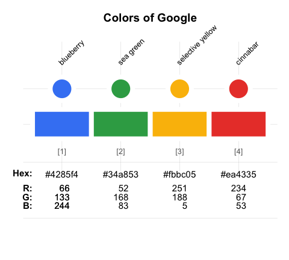
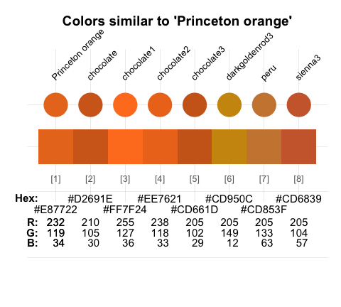
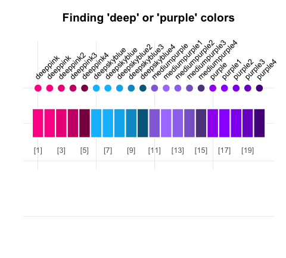

<!-- README.md is generated from README.Rmd. Please edit THIS (Rmd) file. -->

# Making the colours of the University of Tuebingen usable in R

<!-- The **unikn** package enables corporate design elements in\ R. It... -->

This package is build on the original version from the University of
Konstanz (**unikn** package) and adds the colors of the University of
Tuebingen. This package is for internal use only and limited to the
members of the University of Tuebingen. The following states the general
information for the **unikn** package which also applies to this
adjusted package called **colorCodes**. I added two palettes for the
primary and secondary colors called “uni_tuebingen_1” and
“uni_tuebingen_2”.

### Overview

<!-- Motivation    -->

Many institutions devise and impose corporate designs (CDs) for creating
and maintaining a consistent impression in presentations and
publications. Even when writing an article or thesis, it usually makes
sense to define some graphical elements (e.g., a color scheme) and use
them consistently throughout a project.

<!-- Contents/goals of the unikn pgk: -->

The **colorCodes** package facilitates the use of corporate design elements
for R users. It currently contains dedicated **colors** and **color
palettes** of the [University of
Tuebingen](https://www.uni-tuebingen.de/), plus many additional color
palettes from other institutions. In addition, **colorCodes** provides a
range of **color functions** that make it easy to define, modify, find,
and use colors in R. 

<!-- Overview: -->

The **colorCodes** package currently provides five types of objects and
functions:

1.  Pre-defined **color palettes** (e.g. `uni_tuebingen_1`);

2.  Functions for **viewing and comparing colors** (`seecol()`), for
    **using or changing color palettes** (`usecol()`), and for
    **demonstrating color palettes** (`demopal()`);  

3.  Functions for **creating new color palettes** (`newpal()`), for
    **finding similar colors** (`simcol()`), and for **searching color
    names** (`grepal()`);

4.  Functions for **plotting graphical objects** (e.g., boxes and
    frames);  

5.  Functions for **plotting styled text** elements (e.g., highlighting
    and underlining text).  
    <!-- 6. Graphical support (e.g., commands and themes for creating scientific visualizations). -->


### Installation

The current development version can be installed from its
[GitHub](https://github.com) repository at
<https://github.com/stefgr1/colorCodes>:

``` r
devtools::install_github('stefgr1/colorCodes')  
library(colorCodes)          # loads the package
```

## Colors and color palettes

The package contains two palettes for the primary and secondary colors. The user may identify the belonging colours
to each palettes by executing the following code. 

``` r
# Primary colours
seecol("uni_tuebingen_1")

# Secondary colours
seecol("uni_tuebingen_2")
```

**colorCodes** exports these color palettes as data frames that can be
accessed by number, value, or name:

``` r
# Accessing colors from palettes:
uni_tuebingen_1              # color palette of 3 colors
uni_tuebingen_1[1]           # preferred (named) color 1 ("ut_red")
uni_tuebingen_1[[1]]         # color value 1: "#A51E37" 
uni_tuebingen_1["ut_red"]  # color by name
```

## Color-related functions

Beyond defining colors and color palettes, the **colorCodes** package
provides a range of tools for viewing and manipulating colors:

- Two main functions — `seecol()` and `usecol()` — provide a simple
  interface for *viewing* and *using* color palettes.

- Additional color functions (i.e., `simcol()`, `grepal()`, `newpal()`,
  `shades_of()`, or `ac()`) provide auxiliary functionality (for finding
  similar colors and color names, creating new color palettes and color
  gradients, or adjusting transparency).

<!-- Examples: -->

### Seeing color palettes with `seecol()`

The `seecol()` function enables either inspections of an individual
color palette or comparisons between multiple color palettes.

#### Viewing a color palette

Using `seecol()` on an individual color palette provides a quick
overview over its colors and details:

``` r
# Inspect an individual color palette:
seecol(pal = uni_tuebingen_1,             # a color palette / list of palettes / keyword
       col_brd = "white", lwd_brd = 5,     # color and width of borders
       main = "Colors of the University of Tuebingen")  # plot title 
```

### Using color palettes with `usecol()`

Colors and color palettes in R come in various types (e.g., as named
colors, RGB values or Hex codes) and forms (e.g., as data frames or
vectors). The `usecol()` function provides a generic wrapper for
changing (e.g., mixing and re-scaling) and using color palettes. This
allows using colors in **base** R and most other R packages. For
instance, we can easily use colors in combination with

- the `barplot()` function of the **grDevices** package:

``` r
# Mix some colors into a new palette:
my_pal <- usecol(c(uni_tuebingen_1[1], "white", uni_tuebingen_1[2]), n = 9)

# Use color palette:
barplot(1/sqrt(1:9),  col = my_pal)
```

- the `ggplot()` function of the **ggplot2** package:

``` r
# Mix a color gradient: 
my_col <- usecol(c(uni_tuebingen_1[1], "white", uni_tuebingen_1[3]), n = 50)

# Plot (with ggplot2):
library(ggplot2)

ggplot(my_data, aes(x = X, y = Y, fill = Group)) + 
  geom_area() +
  scale_fill_manual(values = my_col) +
  theme_void() +
  theme(legend.position = "none")
```


#### Illustrating color palettes

The `demopal()` function provides a quick illustration of a pre-defined
or modified color palette:

``` r
demopal(usecol(uni_tuebingen_1, n = 3),  # use a modified color palette
        type = "curve", seed = 2)        # reproducible randomness
```

### Creating color palettes with `newpal()`

The `newpal()` function allows creating new color palettes (as data
frames or vectors, with optional color names). Whereas **unikn** was
developed in an academic context, color palettes for other entities and
purposes can easily be created. For instance, let’s define a color
palette of the well-known [Google](https://www.google.com/) logo in
3 steps:

1.  Choose some colors (from named R colors, or by RGB/HEX/HCL values,
    e.g., from sites like <https://www.schemecolor.com>).

2.  Define the colors (and optional color names) as R vectors (of type
    character).

3.  Use the `newpal()` command to define a new color palette.

We can now use the new palette in visualizations (e.g., inspect it with
the `seecol()` function, use it in visualizations, or modify it further
with the `usecol()` function):

``` r
# 1. Choose colors:
# Google logo colors (from <https://www.schemecolor.com/google-logo-colors.php>)

# 2. Define colors and color names (as vectors):
color_google <- c("#4285f4", "#34a853", "#fbbc05", "#ea4335")
names_google <- c("blueberry", "sea green", "selective yellow", "cinnabar")

# 3. Define color palette:
pal_google <- newpal(color_google, names_google)

# Inspect color palette:
seecol(pal_google, 
       col_brd = "white", lwd_brd = 8,
       main = "Colors of Google")
```




### Finding colors

When creating visualizations, we often face two search situations:

- Finding colors that look similar to a given color
- Finding colors that match particular names

The `simcol()` and `grepal()` functions of **unikn** address both
situations.

#### Finding similar colors with `simcol()`

- Which R colors are similar to the “Princeton orange” of the
  `uni_princeton_0` palette?

``` r
simcol(col_target = uni_princeton_0["Princeton orange"], tol = 30)
```



    #> Princeton orange        chocolate       chocolate1       chocolate2 
    #>        "#E87722"      "chocolate"     "chocolate1"     "chocolate2" 
    #>       chocolate3   darkgoldenrod3             peru          sienna3 
    #>     "chocolate3" "darkgoldenrod3"           "peru"        "sienna3"

By default, `simcol()` considers all unique named `colors()` of R, but
its search range can be adjusted by its `col_candiates`, `tol`, and
`distinct` arguments.

#### Finding color names with `grepal()`

The `grepal()` function allows finding colors by matching their name to
a pattern.

Specifically, `grepal(pattern, x)` searches a color palette `x` (i.e., a
vector of color names or data frame of named colors) for elements that
match a `pattern` and returns those elements (colors) that match the
pattern. The `pattern` can be a regular expression.

By default, `grepal()` searches the 657 named colors provided by
`colors()` in **base** R. To make the `grepal()` more flexible, its
`pattern` argument can use regular expressions:

``` r
# Find colors matching a pattern: 
deep_purple <- grepal(pattern = "deep|purple", plot = FALSE)

# See color palette:
seecol(deep_purple, 
       col_brd = "white", lwd_brd = 2, 
       main = "Finding 'deep' or 'purple' colors")
```



Providing a list of color palettes to the `pal` argument of `seecol()`
allows comparing multiple color palettes:

``` r
# Find colors matching some term(s):
olives  <- grepal("olive", plot = FALSE)
oranges <- grepal("orange", plot = FALSE)

# See color palettes:
seecol(pal = list(olives, oranges), 
       pal_names = c("olives", "oranges"), 
       main = "Comparing olives with oranges")
```


### Additional color palettes

Additional palettes for other institutions were orginally provided by **unikn** and are still kept within this package. Here is an overview of the palettes:

- [Caltech](https://www.caltech.edu/): `caltech_pal_1`, `caltech_pal_2`,
  `caltech_pal_3`
- [ETH Zurich](https://ethz.ch/): `eth_pal_1`, `eth_pal_2`, `eth_pal_3`
- [Free University Berlin](https://www.fu-berlin.de/en/index.html):
  `fu_pal_0`, `fu_pal_1`, `fu_pal_2`, `fu_pal_3`
- [Humboldt University Berlin](https://www.hu-berlin.de/en): `hu_pal_1`,
  `hu_pal_2`
- [LMU Munich](https://www.lmu.de/en/index.html): `lmu_pal_1`,
  `lmu_pal_2`, `lmu_pal_3`
- [Max Planck Society](https://www.mpg.de/en): `mpg_pal`
- [University of Bonn](https://www.uni-bonn.de/en): `uni_bonn_1`,
  `uni_bonn_2`
- [University of Freiburg](https://uni-freiburg.de/): `uni_freiburg_0`,
  `uni_freiburg_1`, `uni_freiburg_2`,  
  (from 2022: `uni_freiburg_br`, `uni_freiburg_blue`,
  `uni_freiburg_grey`, `uni_freiburg_info`)
- [University of Göttingen](https://uni-goettingen.de/):
  `uni_goettingen_1`, `uni_goettingen_2`, `uni_goettingen_3`
- [University of Hamburg](https://www.uni-hamburg.de/): `uni_hamburg_1`,
  `uni_hamburg_2`
- [University of Jena](https://www.uni-jena.de/): `uni_jena_1`,
  `uni_jena_2`
- [Kiel University](https://www.uni-kiel.de/en/): `uni_kiel_1`,
  `uni_kiel_2`
- [University of Köln](https://www.uni-koeln.de/): `uni_koeln_1`,
  `uni_koeln_2`
- [University of Konstanz](https://www.uni-konstanz.de/):
  `uni_konstanz_1`, `uni_konstanz_2`
- [University of Mannheim](https://www.uni-mannheim.de/):
  `uni_mannheim_1`, `uni_mannheim_2`
- [Princeton University](https://www.princeton.edu/): `uni_princeton_0`,
  `uni_princeton_1`, `uni_princeton_2`
- [University of Regensburg](https://www.uni-regensburg.de/):
  `uni_regensburg_1`, `uni_regensburg_2`, `uni_regensburg_3`
- [University of Ulm](https://www.uni-ulm.de/): `uni_ulm_1`, `uni_ulm_2`
- [Rensselaer Polytechnic Institute](https://www.rpi.edu/): `rpi_pal_1`,
  `rpi_pal_2`, `rpi_pal_3`
- [RPTU Kaiserslautern-Landau](https://rptu.de/): `rptu_pal`

<!-- Note: Duplicate image in vignette color_inst.Rmd -->

``` r
# Inspect additional/alternative color palettes:
seecol("add")
```


These 52 palettes are exported (as named vectors), documented (to credit
their contributors and sources), and can easily be used and modified by
the R community (e.g., in visualizations).

## Text decorations

Beyond colors and color functions, **colorCodes** provides functions for
plotting graphical elements (like boxes) and styled text elements (with
lines or background decorations). By default, the text-decoration
functions assume that you want to add styled text to an existing plot,
unless the `new_plot` argument specifies a type of plot to be generated.
As the use of these functions is explained in detail in the vignette on
[Text boxes and
decorations](https://hneth.github.io/unikn/articles/text.html), we only
provide some examples here.

### Mark

The `mark()` function allows emphasizing text by plotting it with
colored background (to provide the functionality of “Markieren”):

``` r
mark(labels = c("Markieren", "ist ein Bestandteil", "von Studieren."), 
     x = 0, y = .8, y_layout = .03, cex = 1.5, new_plot = "slide")
```


### Underline

The `uline()` function allows emphasizing text by plotting it with
colored underlining (to provide the functionality of “Unterstreichen”):

``` r
uline(labels = c("Linear", "Authentic", "Flexible", "Open", "Practical"), 
      x = .05, y = .9, y_layout = "even", cex = 1.1, font = 2, new_plot = "slide")
```


### Post

The `post()` function allows adding text to a rectangular `xbox` (to
provide the functionality of “Merken”):

``` r
xbox(col = usecol(pal_seeblau[[5]]), dim = c(2, 2))
post(labels = c("Für eine", "Kultur der", "Kreativität"), x = .1, y = .8, cex = 1.4, font = 2)
```


The color and font parameters can be adjusted to obtain different looks:

``` r
post(labels = c("creative.", "together"), new_plot = "xbox", 
     y_layout = .02, cex = 2, font = c(1, 3),  
     col_bg = pal_seegruen[[1]], col = c(Petrol, Pinky))
```


### Headings

The `heading()` function is a convenient wrapper around `mark`:

``` r
heading(labels = c("pa-", "ra-", "die-", "sisch"))
```


### Using custom color palettes

All **unikn** color palettes and user-generated color palette (e.g.,
defined by `newpal()` or `usecol()`) can be used for graphical
annotations. For example:

- Using the color palettes of academic institutions (see the vignette on
  [Institutional
  colors](https://hneth.github.io/unikn/articles/color_inst.html)) with
  text decoration functions:


- Using the color palette `pal_google` (defined above):


See the vignette on [Text boxes and
decorations](https://hneth.github.io/unikn/articles/text.html) for
additional examples.

### Caveats

Please note the following caveats:

- Plotting text (i.e., graphically rendering characters) is rarely a
  good idea. It typically doesn’t scale (when changing the size of
  images) and cannot be recognized automatically (e.g., copied, indexed,
  or scraped). Hence, the corresponding **unikn** functions should only
  be used in contexts in which no better solutions are available or
  practical (e.g., when specifically creating images, or adding
  annotations to graphs).

- Our templates — just like all others — are subject to constraints and
  limitations. As a standard installation of R lacks the “Theinhardt”
  fonts, we can only mimic the official design specifications (in Arial,
  sans serif). Nevertheless, the **unikn** package helps preventing
  common mistakes by novices (e.g., boxes or lines extending beyond
  text, or step-functions in multi-line titles) and can be customized
  and improved by expert users.

Overall, the **unikn** functions can be useful for solving color-related
tasks and plotting graphical elements (e.g., boxes, logos, etc.).
Ideally, it should help you in creating a stylish and recognizable
design for your presentations and visualizations.


## Copyrights

<!-- uni.kn logo and link: -->
<!--  -->

<a href = "https://www.uni-konstanz.de/">

</a>

The [University of Konstanz’s Corporate
Design](https://www.uni-konstanz.de/en/university/news-and-media/create-online-and-print-media/corporate-design/) (CD)
was created by [Strichpunkt GmbH](https://www.strichpunkt-design.de/)
and the [University of Konstanz](https://www.uni-konstanz.de/) in 2014.
The **unikn** package authors are members of the research group [Social
Psychology and Decision Sciences](https://www.spds.uni-konstanz.de/)
(SPDS) at the [University of Konstanz](https://www.uni-konstanz.de/). We
facilitate access to CD elements for fellow users of R (e.g., for
creating scientific visualizations), but all copyrights on the design
remain with the original copyright holders.

We aim for an authentic representation of a highly-specified corporate
design. While rigid specifications help to maintain coherence and
consistency, they also tend to cause frustration in expert users. As the
design has been developed in a flexible way that allows for individual
elements to be modified as needed, we allow for some liberties, mostly
by relaxing some restrictions. Examples include:

- enabling finer color gradients and arbitrary combinations of color
  palettes (by applying the `seecol()` and `usecol()` functions to color
  palettes);  
- providing a designated `Signal` color (from `pal_signal`);  
- using the spelling “color” (rather than “colour”) throughout the
  **unikn** package.

### License

<!-- unikn pkg logo and link: -->

<a href = "https://CRAN.R-project.org/package=unikn">

</a>

<!-- License: CC BY-SA 4.0 (also in Description) -->
<!-- Image with link: -->

<a rel="license" href="https://creativecommons.org/licenses/by-sa/4.0/"></a>

<!-- Text with links: -->

<span xmlns:dct="https://purl.org/dc/terms/"
property="dct:title"><strong>unikn</strong></span> by
<a xmlns:cc="https://creativecommons.org/ns#" href="https://github.com/hneth/unikn" property="cc:attributionName" rel="cc:attributionURL">Hansjörg
Neth and Nico Gradwohl</a> is licensed under a
<a rel="license" href="https://creativecommons.org/licenses/by-sa/4.0/">Creative
Commons Attribution-ShareAlike 4.0 International License</a>. (Based on
a work at
<a xmlns:dct="https://purl.org/dc/terms/" href="https://github.com/hneth/unikn" rel="dct:source">https://github.com/hneth/unikn</a>).

### Citation and References

To support our efforts, please cite the **unikn** package in derivations
or publications:

<!-- Citation / reference (in APA format): -->

- Neth, H., & Gradwohl, N., (2023). unikn: Graphical elements of the
  University of Konstanz’s corporate design.  
  Social Psychology and Decision Sciences, University of Konstanz,
  Germany.  
  Computer software (R package version 0.8.0, January 6, 2023).  
  Retrieved from <https://CRAN.R-project.org/package=unikn>.  
  doi [10.5281/zenodo.7096191](https://doi.org/10.5281/zenodo.7096191)

<!-- BibTeX:  -->

A BibTeX entry for LaTeX users is:

    @Manual{,
      title = {unikn: Graphical elements of the University of Konstanz's corporate design},
      author = {Hansjörg Neth and Nico Gradwohl},
      year = {2023},
      organization = {Social Psychology and Decision Sciences, University of Konstanz},
      address = {Konstanz, Germany},
      note = {R package (version 0.8.0, January 6, 2023)},
      url = {https://CRAN.R-project.org/package=unikn},
      doi = {10.5281/zenodo.7096191},
    }

<!-- Copyrights of designs: -->

The copyrights to all [uni.kn](https://www.uni-konstanz.de/) designs
remain with their original creators:

- [The University of Konstanz’s corporate
  design](https://www.uni-konstanz.de/en/university/news-and-media/create-online-and-print-media/corporate-design/the-university-of-konstanzs-corporate-design/)
  (Version 1.6, September 2015)  
- [Colours for complex
  graphics](https://www.uni-konstanz.de/en/university/news-and-media/create-online-and-print-media/corporate-design/colours-for-complex-graphics/)  
- Strichpunkt GmbH, [‒
  strichpunkt-design.de](https://www.strichpunkt-design.de/)

------------------------------------------------------------------------

<!-- Footer: -->

\[File `README.md` updated on 2023-03-01.\]

<!-- eof. -->
